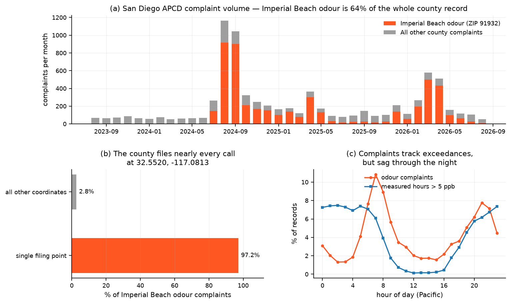
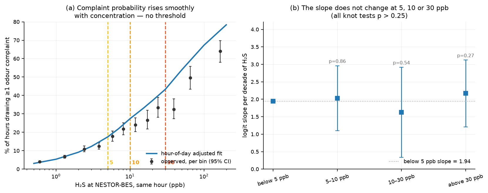
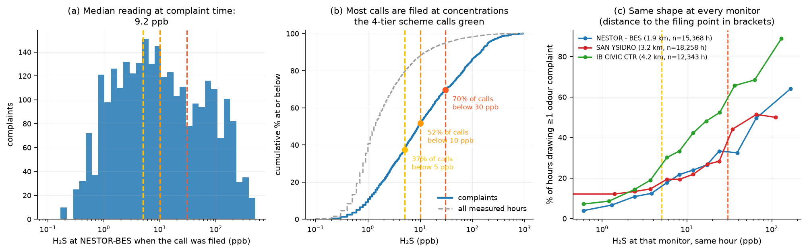
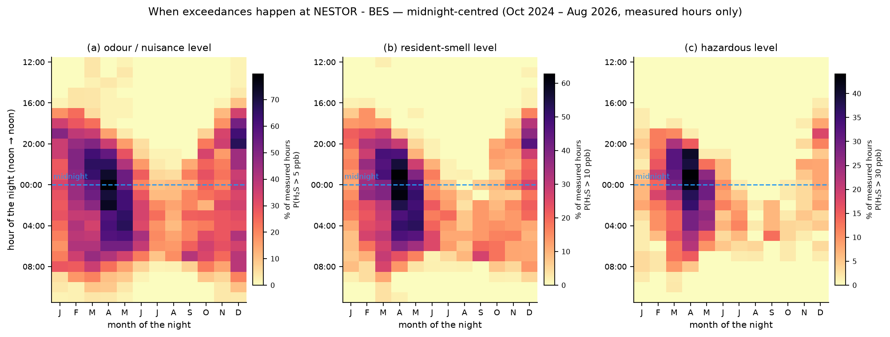
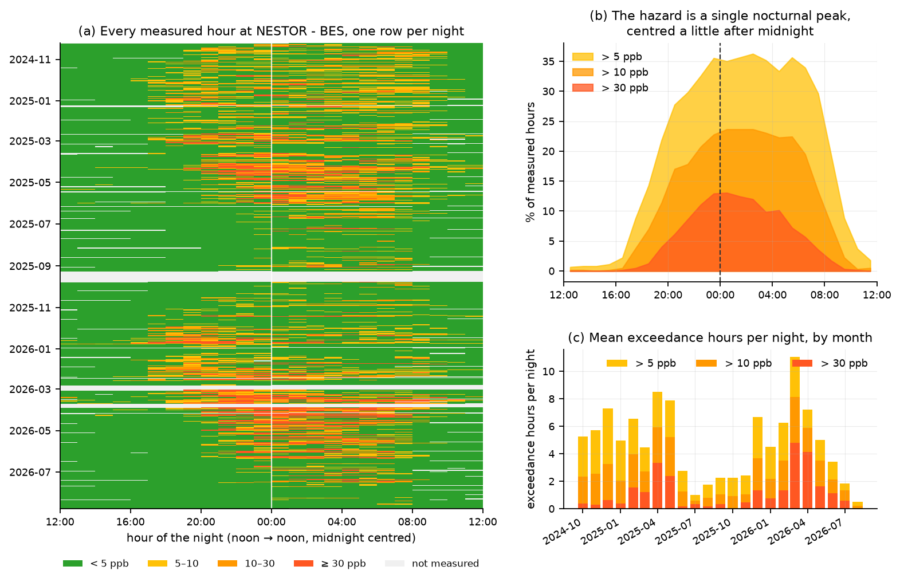
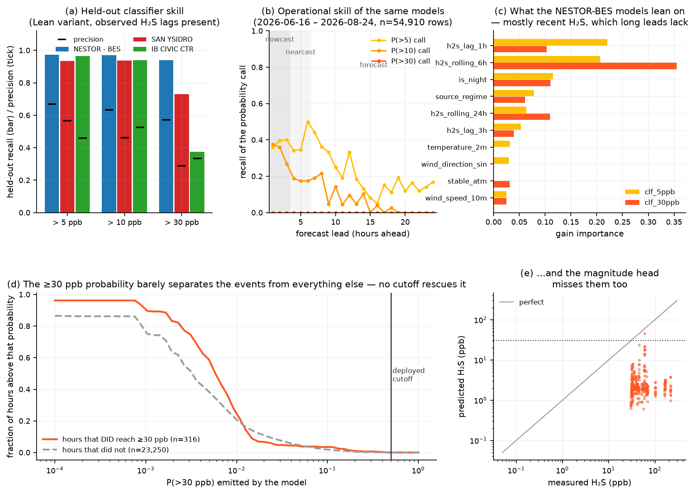
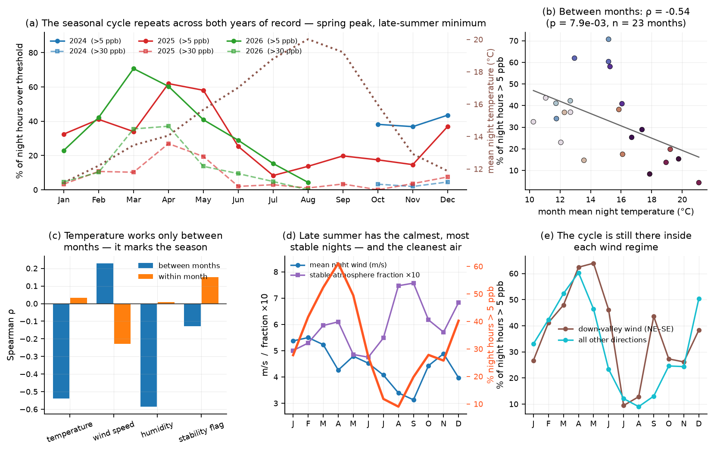

# Hydrogen sulfide and odour complaints in the Tijuana River Valley

**What concentration do residents complain at, when does the hazard occur, and how well is it forecast?**

*Draft — Resilient Collective. Analysis regenerated by `run_all.py`; every figure
and number traces to a script and a public URL in [`APPENDIX.md`](APPENDIX.md).*

---

## Summary

Three years of San Diego APCD odour complaints (n = 4,928 for Imperial Beach)
were joined, hour by hour, to the county's H₂S monitor record for the Tijuana
River Valley. Four results:

1. **There is no complaint threshold.** The probability that an hour draws an
   odour complaint rises log-linearly with H₂S across the whole measured range,
   from 4% of hours below 1 ppb to 64% above 100 ppb. Tests for a slope change
   at exactly 5, 10 and 30 ppb all fail (p = 0.86, 0.54, 0.27). Complaints do
   not "switch on" at 5–10 ppb, and 30 ppb is not a second inflection. Every
   decade of concentration multiplies the odds of a complaint by about 7.
2. **But most complaints are filed in the green tier.** 37% of calls come in
   when the nearest monitor reads under 5 ppb, and 52% under 10 ppb. The median
   reading at complaint time is 9.2 ppb. A 5 ppb alert threshold does not cover
   what residents are reacting to.
3. **The hazard is nocturnal and strongly seasonal.** 87% of hours over 5 ppb
   and 95% of hours over 30 ppb fall between 20:00 and 08:00. Night exceedance
   rates peak in March–April (61% of April night hours over 5 ppb, 32% over 30)
   and bottom out in July–August (10–12% over 5 ppb, under 1% over 30 in
   August). The cycle repeats across both years of record.
4. **Cool nights are dirtier, but temperature is not the mechanism.** Between
   calendar months, mean night temperature correlates with the exceedance rate
   at ρ = −0.54. Within a month, night-to-night temperature deviations carry
   ρ = +0.03 — nothing. The local dispersion drivers run the wrong way
   entirely: late summer has the year's calmest nights (August 3.4 m/s,
   September 3.1, against 5.5 in March) and the highest stable-atmosphere
   fraction (0.75–0.76 against 0.58), and also its cleanest air. The
   seasonality is in the source, not in the weather at the monitor.

A fifth result is operational rather than scientific: over the current
validation window the deployed models' **P(>30 ppb) call fired on none of the
316 hours that actually reached 30 ppb**, and no choice of cutoff recovers it
(§4.3). Two data feeds are also degraded (§6).

---

## 1. Data and method

| Source | What | Coverage used |
|---|---|---|
| SD APCD complaints (ArcGIS feature service) | 7,705 complaint records, 6,374 odour, 4,928 in ZIP 91932 | 2023-08-05 → 2026-08-16 |
| `modeldata_h2s_nofill.parquet` | hourly H₂S + meteorology + flow/tide, three monitors | NESTOR-BES 2024-10-09 → 2026-08-24, 15,368 measured hours |
| Station `training_report.json` × 3 | held-out metrics + feature lists for the deployed models | trained 2026-08-01 |
| `forecast_skill_report.json`, `validation_store/validation.parquet` | operational forecast skill | 2026-06-16 → 2026-08-24, 54,910 rows |

Everything is public — no credentials. URLs in [`APPENDIX.md`](APPENDIX.md).

**One thing had to be worked around.** The published
`latest/tijuana/sd_complaints/complaints.csv` carries only `date_received`,
which is date-only: every record lands at local midnight, so no sub-daily
analysis is possible from it. The county's feature service also exposes
`date_and_time_received`, the real clock time of the call, and it is populated
for all 7,705 records. This report queries the service directly. **The published
asset should carry that field** (§6.2).

Gap-filled H₂S hours are excluded throughout. A synthetic value must never be
counted as an observed exceedance.

**Analysis unit.** All complaint analysis is at the ZIP level, never spatial:
97.2% of Imperial Beach odour complaints are filed at one repeated coordinate
(32.5520, −117.0813). That is a records-management artifact of how the county
logs calls, not where anyone smelled anything. It happens to sit 1.9 km from
NESTOR-BES, which is why that monitor is the primary reference here; the results
reproduce at the other two (Figure 3c).

---

## 2. Odour complaints against H₂S levels

### 2.1 What the complaint record is



**Figure 1.** (a) Imperial Beach odour complaints are 64% of the entire San
Diego County complaint record, and they arrive in bursts — 916 and 903 calls in
August and September 2024 (before the Nestor monitor's record begins), and a
second surge of 498 and 432 in March–April 2026, against a mid-2025 baseline of
16–29 calls a month.
(b) The spatial collapse. (c) Complaints track exceedances through the day but
sag through the small hours: exceedances are flat from 20:00 to 08:00 while
complaints fall away between 01:00 and 04:00 and spike at 06:00–08:00. People
report when they are awake. Every estimate below is adjusted for this.

### 2.2 The dose-response

A lag scan settles the join: the association between hourly complaint counts and
H₂S peaks at **lag 0** (ρ = 0.280) and falls away symmetrically on both sides.
Complaints are filed while the odour is present, so the same-hour join is right.



**Figure 2.** (a) Probability that a measured hour at NESTOR-BES draws at least
one Imperial Beach odour complaint, by concentration. Points are observed rates
with Wilson 95% intervals; the line is a logistic fit with a full set of
hour-of-day dummies, evaluated over the observed mix of hours. (b) The same fit
is piecewise-linear in log₁₀(concentration) with knots at the three operational
thresholds; the plotted slopes are the segment slopes and the p-values test
whether the slope changes at each cut point.

| H₂S (ppb) | Hours in bin | % drawing ≥1 complaint (raw) | Hour-adjusted |
|---:|---:|---:|---:|
| < 1 | 5,460 | 4.0% | 3.1% (at 0.5 ppb) |
| 1–2 | 3,797 | 6.7% | 5.4% |
| 2–3 | 1,481 | 10.9% | 9.2% |
| 3–5 | 1,437 | 12.5% | 12.3% (at 3) |
| **5–7** | 726 | **17.8%** | **17.5% (at 5)** |
| 7–10 | 612 | 21.7% | 21.9% (at 7) |
| **10–15** | 505 | **24.0%** | **27.4% (at 10)** |
| 15–20 | 282 | 26.6% | 32.9% (at 15) |
| 20–30 | 282 | 33.3% | 37.2% (at 20) |
| **30–50** | 283 | **32.5%** | **43.3% (at 30)** |
| 50–100 | 244 | 49.6% | 53.9% (at 50) |
| > 100 | 259 | 64.1% | 67.3% (at 100) |

The curve is a straight line in log-concentration. The fitted slope below 5 ppb
is 1.94 logits per decade — an odds ratio of **7.0 per tenfold increase** in
H₂S. The slope changes at the three thresholds are +0.09 (p = 0.86), −0.40
(p = 0.54) and +0.54 (p = 0.27): none is distinguishable from zero, and the
confidence intervals are wide enough that a real change of ±0.5 logits/decade
cannot be excluded. What *can* be excluded is a step: nothing in this record
looks like an onset.

> **On the hypothesis.** The expectation going in was an onset between 5 and
> 10 ppb and a second inflection near 30. Neither appears. The reason the 5–10
> ppb range *feels* like the onset is visible in the table: it is where the
> complaint probability crosses ~20%, i.e. where complaints become common enough
> to notice — but the curve was already climbing at the same rate from 0.5 ppb.
> A log-linear response is also what psychophysics would predict: perceived
> odour intensity scales with the logarithm of concentration, and published
> H₂S detection thresholds sit well below the bottom of the range covered
> here. On that reading we are looking at the upper part of a response curve
> whose onset is below what these monitors usefully resolve — which would
> explain the absence of any onset in the data. *[Needs a proper citation for
> the detection-threshold range and the intensity–concentration law before
> publication; a literature search was not able to pin either down from the
> sources available here.]*

### 2.3 What a complaint is actually reporting



**Figure 3.** (a) Distribution of the concurrent NESTOR-BES reading over the
2,746 complaints that fall inside the monitored window. (b) Cumulative share,
against the distribution of all measured hours. (c) The dose-response repeated
at all three monitors.

| | % of complaints below | % of all hours below |
|---|---:|---:|
| 5 ppb | **37.4%** | 79.2% |
| 10 ppb | **51.8%** | 87.9% |
| 30 ppb | **69.8%** | 94.9% |

Median reading at complaint time: **9.2 ppb**. By the production 4-tier scheme,
complaints split 37% green / 14% yellow / 18% yellow-high / 30% orange.

This is the practical finding. The dose-response is steep, but low
concentrations are so much more common than high ones that the *bulk* of
complaints still arrives below the first alert threshold. An alerting scheme
gated at 5 ppb is silent for more than a third of the calls residents make, and
a scheme gated at 30 ppb is silent for 70% of them.

Two readings are possible and the data here cannot separate them:

* residents are genuinely smelling sub-5 ppb H₂S (plausible — it is well above
  the detection threshold), or
* the monitor 1.9 km away is not reading what the complainant's nose is in.
  The valley plume is narrow and the county's single filing point erases any
  chance of testing this spatially.

Both point the same way operationally: **5 ppb is a monitor threshold, not a
nuisance threshold**, and the gap between them should be stated explicitly
wherever the tiers are published.

---

## 3. The H₂S record, centred on midnight

The exceedance climatology on the Nestor H₂S plume dashboard plots hour-of-day
from 00:00 to 23:00. Because the hazard is nocturnal, that axis cuts every event
in half and pushes the two halves to opposite edges of the panel. Re-drawn on a
**noon-to-noon** axis, with midnight in the middle, the whole thing is one
contiguous block.



**Figure 5.** P(H₂S > threshold) by hour of the night and month at NESTOR-BES,
midnight-centred. Cells with fewer than 12 measured hours are blank.

Two things the split-axis version hides:

* **The event window drifts through the year.** The peak >5 ppb hour sits in
  the evening (19:00–22:00) from November through March, crosses midnight in
  April, and is in the small hours or early morning (03:00–07:00) from May
  through September. The hazard is anchored to darkness, not to the clock. (The
  peak-hour statistic is a single-cell argmax and is noisy — October's 06:00
  reads against its neighbours; see [`tables/tbl05_night_window.csv`](tables/tbl05_night_window.csv)
  and judge the drift from the figure, where the whole band moves.)
* **The ≥30 ppb hazard sits in a narrower core.** In April the >5 ppb band is
  ~11 hours wide at half-maximum and the >30 ppb band ~9; by October it is 12
  hours against 3.



**Figure 4.** The same frame applied to the raw record. (a) Every measured hour,
one row per night — no aggregation, coloured by the 4-tier scheme. (b) The diel
profile: the peak is at 02:00 local, and 86.8% of >5 ppb hours and 94.8% of
>30 ppb hours fall between 20:00 and 08:00. (c) Mean exceedance hours per night
by month; the three series are nested (every >30 hour is also a >5 hour), not
stacked. 233 of 657 nights carried at least one hour over 30 ppb.

Panel (a) is the argument for the midnight-centred frame in one image: events
are unbroken horizontal streaks, and the seasonal bands are legible without
anything having been averaged first. The production `h2s_peaks` asset counts
these on a 6 AM / 6 PM clock split, and its astronomical variant on sunset —
both of which split an event that runs 22:00 → 06:00 across two units.

---

## 4. The exceedance-probability models

Each station carries four models per feature variant: a regression on H₂S
magnitude, and binary classifiers at 5, 10 and 30 ppb. Deployed versions at time
of writing: NESTOR-BES `20260714T205654Z`, IB Civic Ctr `20260701T092459Z`,
San Ysidro `20260714T204711Z`, all trained 2026-08-01.

### 4.1 Features

Two variants are deployed side by side. **Evidence** (33 features) is the set
promoted from the 2026-06 ablation; **Lean** (19) drops the engineered
interactions, the wind rolling aggregates, four low-importance weather channels
and the hour-of-day cyclicals. Lean is `PRIMARY_VARIANT` and drives the reports
and the alert cascade.

The full annotated inventory — family, source, which variant, and what each
feature is for — is in [`tables/tbl07_model_features.md`](tables/tbl07_model_features.md),
generated from the deployed models' own metadata so it cannot go stale.

| Family | Count (Evidence) | In Lean | Notes |
|---|---:|---:|---|
| H₂S history | 5 | 5 | `h2s_lag_1h/3h/6h`, `h2s_rolling_6h/24h`. Every one survives the trim; these dominate every model. |
| Wind | 8 | 3 | Raw speed + direction sin/cos survive; the 2h/3h rolling aggregates and gusts are Evidence-only. |
| Regime | 6 | 3 | `is_night`, `source_regime`, `stable_atm` survive; the three engineered interactions do not. |
| Weather | 6 | 2 | Only temperature and humidity survive. |
| Time | 4 | 2 | `month_sin/cos` survive — this is how the seasonality of §5 enters the model. `hour_sin/cos` are Evidence-only, judged redundant with `is_night`. |
| Water | 4 | 4 | `tide_height`, `tidal_state_encoded`, `flow_lag_6h`, `flow_rolling_24h`. **The two flow features read a feed that has been frozen since January — see §6.1.** |

### 4.2 Statistics



**Held-out (nowcast-like) skill**, from `training_report.json`. These are scored
on a held-out slice of the training frame where the H₂S lag features hold
*observed* values — the model is told what the monitor read an hour ago.

| Station | Task | AUC | Recall | Precision | Held-out positives |
|---|---|---:|---:|---:|---:|
| NESTOR-BES | P(>5) | 0.976 | 0.972 | 0.669 | 617 |
| NESTOR-BES | P(>10) | 0.979 | 0.969 | 0.633 | 457 |
| NESTOR-BES | P(>30) | 0.978 | 0.939 | 0.570 | 263 |
| San Ysidro | P(>5) | 0.947 | 0.934 | 0.567 | 773 |
| San Ysidro | P(>10) | 0.963 | 0.937 | 0.462 | 365 |
| San Ysidro | P(>30) | 0.979 | 0.731 | 0.288 | 52 |
| IB Civic Ctr | P(>5) | 0.994 | 0.965 | 0.458 | 57 |
| IB Civic Ctr | P(>10) | 0.997 | 0.939 | 0.525 | 33 |
| IB Civic Ctr | P(>30) | 0.997 | 0.375 | 0.333 | 8 |

(Lean variant. The two variants are within 0.005 AUC of each other everywhere,
and within ±0.03 recall at 5 and 10 ppb — the 14 extra Evidence features buy
nothing there. They diverge only at 30 ppb where the positive counts are small:
IB Civic Ctr scores 0.625 recall on Evidence against 0.375 on Lean, but that is
five positives against three out of eight, which is noise. Full table:
[`tables/tbl07_holdout_metrics.csv`](tables/tbl07_holdout_metrics.csv).)

Read the right-hand column before the AUCs. IB Civic Center's P(>30) AUC of
0.997 rests on **eight** positive hours. This is the number behind the
`CLF_30PPB_STATIONS` gate that restricts the orange call to NESTOR-BES, and the
gate is correct: only NESTOR-BES has the positives to hold an operating point.

**Operational skill**, from the validation store (2026-06-16 → 2026-08-24,
54,910 rows), is a different and much lower number:

| Product | Lead | Recall of P(>5) | P(>10) | P(>30) |
|---|---|---:|---:|---:|
| nowcast | 1–3 h | 0.385 | 0.335 | **0.000** |
| nearcast | 4–6 h | 0.396 | 0.179 | **0.000** |
| forecast | 7–24 h | 0.196 | 0.053 | **0.000** |

The collapse between the two tables is structural, not a bug: the models lean on
recent observed H₂S (Figure 7c), and a recursion past lead 3 has none. This is
worth stating plainly in any external write-up. The held-out numbers describe
*"is an event in progress"*; the operational numbers describe *"will one start"*,
and only the first is currently strong.

### 4.3 The ≥30 ppb call never fires

A recall of exactly zero usually means a mis-set cutoff. Here it does not.

Over the validation window, 23,566 rows carried an emitted P(>30). Of those,
**316 hours actually reached 30 ppb** (median 43.6, max 218.8 ppb). On those
hours the emitted P(>30) had a **median of 0.006** and a maximum of 0.40 —
below the 0.5 cutoff at every single one. Sweeping the cutoff does not help:

| Cutoff | Recall @ ≥30 ppb | False-alarm rate |
|---:|---:|---:|
| 0.50 | 0.000 | 0.0005 |
| 0.20 | 0.010 | 0.005 |
| 0.10 | 0.035 | 0.018 |
| 0.05 | 0.038 | 0.046 |
| 0.02 | 0.067 | 0.109 |

Figure 7d shows why: the P(>30) distribution on hours that reached 30 ppb is
barely distinguishable from the distribution on hours that did not. The
magnitude head fails on the same hours (Figure 7e) — median predicted 2 ppb
against a median measured 43.6 ppb. This is the same failure mode as
`docs/RED_TIER_RECALL_DIAGNOSIS.md`.

Caveats that keep this honest. The window is 2.3 months and its last six weeks
are the seasonal minimum. It spans the 2026-07 seed-freshness fix, but almost
all the ≥30 ppb positives fall on the wrong side of it — 114 of the 129
forecast-product ≥30 hours are before 15 July — so **this window cannot yet
tell a stale-seed cause apart from a model one**, and re-checking after a full
spring under the fixed seed is the first thing to do. That said, 316 positives
is not a small sample, and a recall of zero at *every* lead from 1 to 24 hours
is not a sampling artifact. **The orange forecast tier
should be treated as non-functional until this is resolved.** The observation
backstop in `cascade_alerts` (which fires on measured H₂S, independent of the
model) is at present the only thing standing behind the orange tier.

> **Related work.** An independent forward Gaussian plume model (Nestor H₂S
> plume dashboard, `forward_plume_v2.py`, 2026-07) reaches F1 0.60 as a binary
> >5 ppb alarm on held-out 2026 and detects 106 of 110 multi-hour episodes, with
> 4.7% pure false-alarm time. That is a physics baseline the statistical models
> should be benchmarked against; it is not evaluated here because its code is
> not in this repository.

---

## 5. Seasonality, temperature, and where the cycle comes from



### 5.1 The cycle is real and large

| Month | Night hours > 5 ppb | > 30 ppb | Median (ppb) | 95th pct | Mean night T (°C) | Mean night wind (m/s) | Stable fraction |
|---|---:|---:|---:|---:|---:|---:|---:|
| Jan | 27.7% | 4.0% | 2.8 | 22.7 | 11.2 | 5.4 | 0.50 |
| Feb | 41.6% | 10.5% | 3.7 | 62.5 | 12.2 | 5.4 | 0.54 |
| Mar | 50.1% | 21.3% | 5.1 | 135.3 | 13.3 | 5.5 | 0.58 |
| **Apr** | **61.2%** | **31.9%** | **9.5** | **203.4** | 14.0 | 4.3 | 0.61 |
| May | 49.3% | 16.5% | 4.9 | 136.2 | 15.7 | 4.8 | 0.48 |
| Jun | 27.1% | 5.8% | 1.7 | 36.6 | 17.0 | 4.5 | 0.47 |
| Jul | 11.8% | 3.9% | 1.2 | 17.5 | 18.8 | 4.1 | 0.55 |
| **Aug** | **9.7%** | **0.6%** | **1.5** | **8.6** | 19.9 | 3.4 | 0.75 |
| Sep | 19.8% | 3.4% | 1.6 | 18.9 | 19.2 | 3.1 | 0.76 |
| Oct | 26.3% | 1.4% | 2.4 | 17.9 | 16.0 | 4.4 | 0.63 |
| Nov | 25.8% | 2.8% | 2.3 | 19.2 | 12.9 | 4.9 | 0.57 |
| Dec | 40.3% | 6.0% | 3.9 | 40.9 | 11.9 | 4.0 | 0.68 |

April night hours are over 5 ppb six times as often as August night hours, and
over 30 ppb fifty times as often. Figure 6a plots the two years separately: 2025
peaks in April–May (64% of night hours >5), 2026 in March–April (68%, 65%). Both
bottom out in July–August. This is a season, not one bad spring. (September 2025
has only 177 night hours from a monitor outage and should be read cautiously.)

### 5.2 Temperature marks the season; it does not drive the hazard

| | Between months (ρ with monthly % >5 ppb) | Within month (ρ with H₂S rank) |
|---|---:|---:|
| Temperature | **−0.54** | +0.03 |
| Humidity | **−0.58** | +0.01 |
| Wind speed | +0.23 | **−0.23** |
| Stability flag | −0.13 | +0.15 |

Read the two columns together. Temperature and humidity have strong *between-month*
associations and essentially zero *within-month* association. Wind speed is the
exact opposite: within a month, calm nights are dirtier (ρ = −0.23, the expected
dispersion effect), but across months the association reverses sign, because the
calm season is the clean season.

A variable that only acts between months is a label for the season. So the
answer to "does H₂S concentrate more in lower temperatures?" is: **seasonally
yes, causally no** — at least not through anything measurable at the monitor.
Two nights in the same month at 10 °C and 16 °C are not meaningfully different.

### 5.3 Dispersion cannot explain it — so it is the source

If cool-night trapping drove the cycle, the calm and stable months would be the
dirty ones. They are the clean ones:

* **Late summer has the year's calmest nights** (August 3.4 m/s, September 3.1,
  against 5.5 in March) **and its highest stable-atmosphere fraction**
  (0.75–0.76 against 0.58) — and 9.7% of August night hours over 5 ppb against
  March's 50.1%.
* **Down-valley (NE–SE) drainage wind is most frequent in Dec–Jan** (85% of
  January night hours, 83% of December's) — not in spring (41% in April). Yet
  December runs at 39% >5 ppb and April at 61%.
* **The cycle survives conditioning on wind direction** (Figure 6e). Inside
  down-valley hours alone: April 63% vs July 9%. Inside every other direction:
  April 59% vs July 12%. Whichever way the wind is blowing, spring nights are
  dirty and midsummer nights are not.

Every local dispersion driver either runs the wrong way or fails to explain the
amplitude. The seasonal signal is therefore in the **emission** term — how much
H₂S the river channel and estuary are producing — not in how it is transported
the last 2 km to the monitor.

What that source seasonality *is* cannot be resolved from these inputs, and the
obvious candidate is not available: the border flow feed has been frozen since
January (§6.1), so 2026 cannot be tested against river flow at all. From 2025
alone, flow does not obviously work either — April 2025 averaged 1.09 m³/s at
night with 64% exceedance, while November 2025 averaged 6.29 m³/s with 14%.
A spring maximum with a late-summer minimum is consistent with sediment and
water temperature lagging air temperature into a window where sulfate reduction
is fast but the channel still carries winter's load, but that is a hypothesis
this dataset cannot test.

**This is the most useful open question in the report.** It is also a model
implication: `month_sin/month_cos` are carrying a real driver the model cannot
see directly, and `temperature_2m`'s standing as the top exogenous feature is
probably it proxying season rather than physics.

---

## 6. Data-quality findings

### 6.1 The border flow feed has been frozen since January

`Flow (m^3/s)--Border` in `modeldata_h2s_nofill` takes exactly one distinct
value — **2.10** — for every hour from 2026-01-01 to 2026-08-24. The last
genuinely varying value is 2025-12-29. Before that the series behaves normally
(153–288 distinct values per month, range 0.02–231).

Two model features read this feed: `flow_lag_6h` and `flow_rolling_24h`. Both
are in the Lean (primary) variant. For eight months they have been constants,
which makes them informationless at best. Any 2026 analysis that treats river
flow as a variable is reading a fill value.

### 6.2 The published complaints asset drops the time of day

`latest/tijuana/sd_complaints/complaints.csv` (and its `.parquet`/`.geojson`
siblings) carry `date_received` only, so every complaint appears at a single
fixed time. None of the analysis in §2 is possible from the published asset —
the entire dose-response depends on `date_and_time_received`, which the upstream
service populates for all 7,705 records but the asset does not export.

The `sd_complaints` asset code *does* read `date_and_time_received` and does set
a `time_of_day_known` flag; the published files (last written 2026-08-18) do
not contain either column. Whatever the cause, the fix is to re-materialise and
confirm the field survives to the output.

### 6.3 Backfilled models were serving during part of the validation window

Some validation rows carry `model_version` = `backfill_2026-05_20260629T194906Z`.
Backfill archives are trained with in-sample validation and flagged
`is_backfill: true`. Mixing them into an operational skill window makes the
resulting numbers hard to attribute. Worth splitting the validation store by
`model_version` before drawing conclusions from any single figure in §4.2.

---

## 7. Limitations

* **Two years at NESTOR-BES.** The seasonal cycle is replicated across two
  years, which is the minimum for calling it a cycle at all. A third year would
  make it solid.
* **One monitor, one filing point, 1.9 km apart.** The complaint analysis rests
  on the assumption that the NESTOR-BES reading is a usable proxy for what a
  complainant smelled. Figure 3c shows the dose-response shape does not depend
  on which monitor is used, but all three are proxies.
* **Complaint counts are not exposure counts.** Reporting propensity varies with
  media attention, season, and whether people have given up calling. The Aug–Sep
  2024 surge is ~910 calls/month against a mid-2025 baseline of 16–29; some of
  that is air quality and some is attention. The hour-of-day adjustment handles the
  within-day confound; it does nothing about the between-month one.
* **The operational window is short.** 2.3 months, six weeks of which are the
  seasonal minimum.
* **Association, not causation, throughout.** Nothing here is an experiment.

---

## 8. What to do next

1. **Fix the two feeds** (§6.1, §6.2). The flow one silently degrades two live
   model features; the complaints one blocks external replication of §2.
2. **Treat the orange forecast tier as non-functional** until §4.3 is resolved,
   and say so wherever P(>30) is published. Investigate whether the pooled
   cross-station ≥30 model already in `experiments/underfitting_results/` fixes
   the probability calibration, not just the per-station positive count.
3. **Publish the gap between the monitor threshold and the nuisance threshold.**
   37% of complaints arrive below 5 ppb. Whatever the 4-tier scheme says, the
   public-facing message should not imply that green means nobody is smelling
   anything.
4. **Report both skill numbers.** Held-out AUC 0.97 and operational P(>5) recall
   0.20–0.40 are both true and describe different tasks.
5. **Chase the source seasonality** (§5.3) — the one genuinely open scientific
   question here. Needs a working flow record, SBIWTP discharge volumes, and
   ideally water/sediment temperature in the channel.
6. **Adopt the midnight-centred frame** for the exceedance assets. The
   production `h2s_peaks` split (6 AM / 6 PM) and the astronomical variant
   (sunset) both cut events in half; a noon-to-noon "night of" frame does not,
   and costs one line of code (`night_frame()` in `fig04_exceedance_midnight.py`).

---

## Reproducing this

```bash
cd reports/h2s_levels_and_complaints
uv venv .venv && uv pip install -r requirements.txt
.venv/bin/python run_all.py --manifest
```

Roughly 15 seconds once the ~10 MB of inputs are cached; a couple of minutes on
a cold cache. Every figure script is standalone and can be run on its own.
[`APPENDIX.md`](APPENDIX.md) maps each figure and table to its script and its
source URLs.
